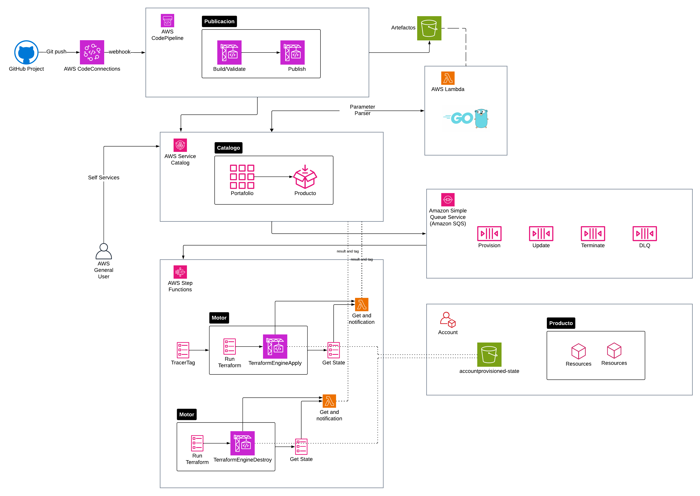

# Infrastructure as a Product

Un catálogo de infraestructura autoservicio sobre **AWS Service Catalog**, con Terraform
como motor de aprovisionamiento.

Un equipo pide un entorno desde la consola de AWS, rellena cuatro campos y lo obtiene.
Sin tener permisos sobre EC2 ni S3, sin escribir Terraform, y sin esperar a que alguien
del equipo de plataforma le atienda.



Dos recorridos independientes sobre las mismas piezas:

**Publicar** — un `git push` al módulo dispara CodePipeline vía CodeConnections. Valida,
empaqueta el `.tar.gz`, lo sube a S3 y registra una versión nueva del producto en el
catálogo.

**Aprovisionar** — el usuario abre el asistente. Service Catalog invoca al *parameter
parser* en Go, que descarga el artefacto y saca los campos del formulario de las `variable`
del módulo. Al pulsar Launch, escribe en la cola SQS que corresponda —provision, update o
terminate— y una Step Function orquesta el `terraform apply` en CodeBuild, con el state en
su propio bucket. Al terminar, notifica el resultado y el tracer tag de vuelta.

```
        terraform init  →  plan -out  →  Infracost  →  apply tfplan
                                            │
                                    ¿supera el tope?
                                    aborta antes de crear nada
```

## Qué hay aquí

```
hands-on/01-terraform-os/     LA PLATAFORMA
  main.tf                     compone los cuatro módulos
  modules/
    engine/                   motor: SQS, Lambdas, Step Functions, CodeBuild
    catalog-bootstrap/        Portfolio, quién accede y con qué rol se aprovisiona
    catalog-shared/           bucket de artefactos + conexión a GitHub
    catalog-pipeline/         CodePipeline — UNA para todo el catálogo

products/                     LO QUE LA PLATAFORMA SIRVE
  standard-environment/       red, almacenamiento y rol de acceso
  data-lake/                  S3 por zonas, catálogo de Glue y Athena

policies/                     políticas de organización que evalúa la pipeline
docs/paso-a-paso.md           el ciclo completo, de clonar a limpiar
```

La separación entre `hands-on/` y `products/` es el asunto del taller. Todo lo primero es
**cómo** se aprovisiona; lo segundo es **qué** se entrega. Un equipo consume lo segundo sin
saber nada de lo primero.

## Desplegar

> **¿Primera vez?** La [guía paso a paso](docs/paso-a-paso.md) recorre todo el ciclo —desde el
> fork hasta aprovisionar un entorno y limpiar— con los tiempos y las salidas reales de cada
> etapa. Unos 25 minutos.

Necesitas `terraform >= 1.5`, `go`, `python3`, `make`, `rsync` y credenciales de AWS.

## Gobierno del catálogo

Dos puertas, en momentos distintos, y la distinción importa:

| | Cuándo | Qué evalúa | ¿Bloquea? |
|---|---|---|---|
| **Pipeline — `Inspect`** | Al **publicar** | Checkov, TFLint, Gitleaks, Conftest sobre el HCL | No |
| **Runner — Infracost** | Al **aprovisionar** | El `plan` real, con los parámetros del usuario | **Sí** |

Al publicar todavía no hay `plan` posible: el producto no se ha aprovisionado y nadie ha
elegido parámetros. Solo se puede revisar lo estructural. El coste real solo se conoce en el
runner.

Por eso `Inspect` es **advisory** — informa, y decide una persona en la aprobación manual.

## Cuándo el catálogo tiene sentido

No siempre. Merece la pena cuando:

- Tus consumidores **viven en la consola de AWS** y no van a usar otra herramienta
- Necesitas que **no tengan permisos**: el Launch Role aprovisiona por ellos
- Tienes **multicuenta** con Organizations, o ya usas Service Catalog para CloudFormation

Si tu gente ya escribe Terraform y tiene acceso a una plataforma que ofrece formularios
sobre módulos, el catálogo añade una capa sin darte nada.

## Multicuenta

Los módulos están escritos para que hub-and-spoke sea un cambio en la composición, no un
rewrite. **No está probado end-to-end.** Tres restricciones documentadas por AWS:

1. **Un solo motor `EXTERNAL` por cuenta hub.** No se puede rodear.
2. **El Launch Role debe existir en cada spoke con el mismo nombre**, y el constraint debe
   usar `LocalRoleName` en vez de `RoleArn`.

   > ⚠️ `catalog-pipeline/buildspec/publish.yml` publica hoy `{"RoleArn": ...}`. Vale para
   > monocuenta; para hub-and-spoke hay que cambiarlo.
3. **Los nombres de Launch Role deben empezar por `SCLaunch`.** Los de este repo no lo
   cumplen: funciona en monocuenta porque el `iam:PassRole` se concede explícitamente.

Lo que ya juega a favor: el runner puede asumir roles en cualquier cuenta
(`arn:aws:iam::*:role/*`), y la clave del state ya empieza por la cuenta del usuario que
lanzó, así que los states quedan separados por spoke sin tocar nada.

## Contribuir y licencia

Ver [CONTRIBUTING.md](CONTRIBUTING.md) y [SECURITY.md](SECURITY.md).

Código propio bajo **Apache 2.0** ([LICENSE](LICENSE)).
`hands-on/01-terraform-os/modules/engine/` deriva del Terraform Reference Engine de AWS y
conserva su licencia Apache 2.0 — detalle en [NOTICE](NOTICE).
